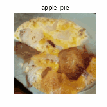
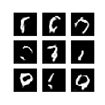

# SNGAN-Projection Tensorflow

This is a Unofficial TF2.0 implementation of [Spectral Normalization for Generative Adversarial Networks](https://openreview.net/forum?id=B1QRgziT-) and [cGANs with Projection Discriminator](https://openreview.net/forum?id=ByS1VpgRZ). 

**[Official implementation is available here](https://github.com/pfnet-research/sngan_projection)**

## Dataset

There are [Food-101](https://www.vision.ee.ethz.ch/datasets_extra/food-101/)and [MNIST](http://yann.lecun.com/exdb/mnist/) training examples. 

I found that it is easier to train 128 * 128 resolutions with dataset which has fewer classes and more examples. For example, I failed to train 64 * 64 res model with [tiny-image-net](https://tiny-imagenet.herokuapp.com/)(200 classes with 500 images in each classes) and [stanford-dogs](http://vision.stanford.edu/aditya86/ImageNetDogs/main.html)(120 classes with 20,580 images). However, I can get relative good result in [Foods-101](https://www.vision.ee.ethz.ch/datasets_extra/food-101/)(101 classes and 101,000 images)

## Environments

* Python 3
* jupyter or jupyterlab
* numpy
* matplotlib
* tensorflow 2.0

## How to Run

1. Download the dataset you want.

2. Clone this repo, then use Juypter Notebook or Lab to open the `*.ipynb` file. 

3. Modify the `DATASET_PATH`, and the parts with **Needs to be modified** in the **Prepare dataset** section.

## Results

Foods: 
* 128 * 128 resolutions
* batch size: 16
* noise dimension: 128
* 430k iterations

MNIST
* 28 * 28 resolutions
* batch size: 64
* noise dimension: 100
* 100k iterations

## Acknowledges

Official implementation, https://github.com/pfnet-research/sngan_projection

crcrpar's repo, https://github.com/crcrpar/pytorch.sngan_projection